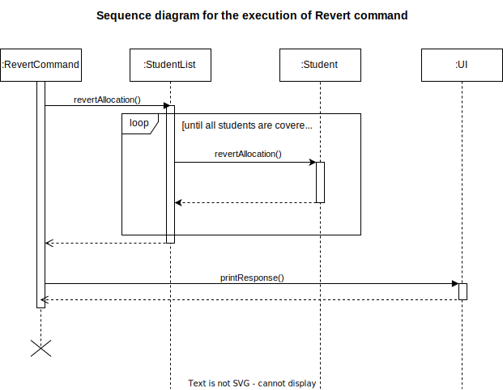
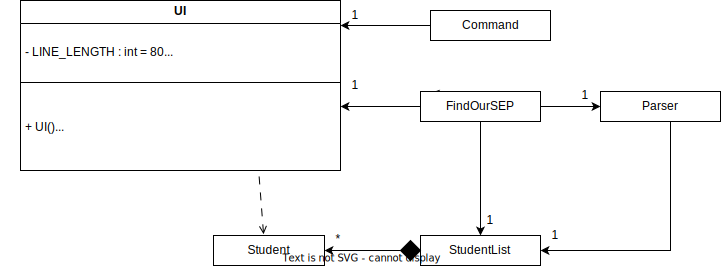

# Developer Guide

## Table of Contents
- [Acknowledgements](#Acknowledgements)
- [Installation](#Installation)
- [Design & Implementation](#design--implementation)
  - [Architecture](#architecture)
  - [Commands](#commands)
    - [Add Command](#add-command)
    - [Delete Command]()
    - [Criteria Command]()
    - [Find Command]()
    - [Filter Command]()
    - [List Command]()
    - [Stats Command]()
    - [ViewQuota Command]()
    - [Allocate Command]()
    - [Revert Command]()
    - [Generate Command]()
    - [Help Command]()
    - [Exit Command]()
    - [Unknown Command]()
  - [Components]()
    - [Frontend / User Interface](#frontend--user-interface)
    - [Parser](#parser)
    - [Allocator](#allocator)


## Acknowledgements

This project utilizes the following dependencies:

- [JUnit 5.10.0](https://mvnrepository.com/artifact/org.junit.jupiter/junit-jupiter-api/5.10.0) for testing.
- [AsciiTable 0.3.2](https://mvnrepository.com/artifact/de.vandermeer/asciitable/0.3.2) for formatting tables.
- [Jackson Databind 2.18.0](https://mvnrepository.com/artifact/com.fasterxml.jackson.core/jackson-databind/2.18.0) for JSON processing.
- [OpenCSV 5.9](https://mvnrepository.com/artifact/com.opencsv/opencsv/5.9) for CSV parsing.

Many thanks to the developers and maintainers of these libraries for their incredible work. Their efforts have significantly contributed to the success of this project.

## Installation

To get started with this project, follow these steps:

## Prerequisites

- Java 17
- Download the latest `.jar` from [here](https://github.com/AY2425S1-CS2113-W12-2/tp/releases/tag/v1.0).

## Steps

1. **Copy the `.jar` file:**
    - Move the downloaded `.jar` file into a designated folder on your computer.

2. **Prepare your data file:**
    - If you want to parse a file (.CSV, .JSON, .TXT) containing student data, ensure you have the absolute path ready for that file.

3. **Run the `.jar` file:**
    - Open a terminal.
    - Navigate (`cd`) to the folder containing the `.jar` file.
    - Execute the `.jar` file using the following command:
      ```shell
      java -jar FindOurSEP.jar
      ```


🎉 Congratulations! You’re all set to dive into the wonders of this project. Enjoy the ride!

## Design & Implementation

### Architecture


### Commands

#### Add Command

#### Delete Command

#### Criteria Command

#### Find Command

#### Filter Command

#### List Command

#### Stats Command

#### ViewQuota Command

#### Allocate Command

#### Revert Command



Upon parsing a `revert` command, a `RevertCommand` instance is created. `RevertCommand` then calls the `revertAllocation()`
method in `StudentList`, which loops through all the students in the `students` array list. The method `revertAllocation()`
within the `Student` objects resets the allocation status and allocated university. The operation is completed by calling
the `UI` to print the templated response from the `Messages` enum.

#### Generate Command


The `generate` command is calls the `generateReport()` method in `StudentList`, which then calls the `generateReport()`
in the `UI` using the student array list, which prints an ASCII table representing the allocation outcome.

#### Help Command

#### Exit Command


#### Unknown Command


## Components

### Frontend / User Interface
FindOurSEP is primarily a Command-Line Interface (CLI) based Java Application. The frontend currently consists of 2 main
components:
1. `UI` class - Manages interactions with the user, including printing messages, tables, and capturing user inputs.
2. `Messages` enum - Stores standardized messages for consistent user prompts and feedback across the application.

#### 1. `UI` Class
   The `UI` class is designed to handle both input and output for the command-line interface. It manages user prompts, 
   input retrieval, and formatting for both regular messages and ASCII tables displaying lists.

Here is the class diagram highlighting the structure of the `UI` class.


How `UI` Works:
1. Whenever the program needs to interact with the user, it does so through the `UI` class, which serves as a **facade** 
    between the logical backend components and the user interface elements.

2. The `UI` class is responsible for displaying messages, receiving user input, and printing data formatted as tables or 
text responses.

3. Upon receiving a message or command request, the UI class formats the message, incorporating relevant content 
(e.g., student details or allocation results) before displaying it to the user. This approach maintains separation 
between backend logic and the presentation layer.

4. For each user action, such as displaying a list of students or allocating slots, the `UI` class uses helper methods 
(e.g., `printStudentList`, `generateReport`) to format and render the output. The methods ensure the responses are 
consistent and user-friendly.

The `UI` class methods typically return `void`, but will print responses directly to the console or handle user input, 
streamlining interactions and allowing the backend to focus solely on data processing. `UI` returns a type when there is
data that needs to be passed from the frontend to the program logic, e.g. `getUserInput` return a `String`

#### 2. `Messages` Enum
The `Messages` enum centralizes common UI messages. For example, `Messages.ERROR` is passed to the UI for
display for default errors. This keeps responses uniform and allows for changes to user-facing text without modifying
backend logic. List of all `Messages`:

`WELCOME`: Greeting message displayed at startup.

`EXIT`: Farewell message when exiting.

`ALLOCATE_COMPLETE`: Shown upon completion of the allocation process.

`HELP`: Multi-line help message listing all available commands and their descriptions.

`ERROR`: General error message for unexpected issues.

`REVERT_COMPLETE`: Message displayed after a successful revert operation.

Each message can be accessed and printed via `Messages.<MESSAGE_NAME>` in the `UI` class or any other class that
references it.

#### Customizing and Extending the UI
Adding New Messages:
1.  Open the `Messages` enum.
2.  Add a new constant with the message text. Example:
```java
NEW_MESSAGE("Your custom message text here");
```
3. Reference the new message in the `UI` class or any other relevant part of the application using `Messages.NEW_MESSAGE`


### Parser

The `Parser` class is a crucial component instantiated as soon as FindOurSEP is initialized. Its responsibility is to process the user’s input into commands and invoking the correct command object for the rest of the program.

Some of its core features include:
- Breaking down user input and extracting the relevant command and data for further processing.
- Provide robust error handling when unknown command is received.
- Validate data parsed in from external file (.CSV, .JSON, .TXT) sources. (Further details in the `FileHandler` class)

Here is a class diagram highlighting the fundamental structure of the `Parser` class.


How `Parser` works:
1. Whenever the user enters an input, the input will be directed to the `Parser` class's `parseInput()` method.
2. Within the method, the command will be extracted and the appropriate `XYZCommand` object (XYZCommand is a placeholder for various commands such as DeleteCommand, ListCommand, etc.) will be instantiated.
3. Upon instantiation, the `XYZCommand` is prepared for execution. Each `XYZCommand` class, inheriting from the abstract `Command` class, has a `run()` method that executes its specific instructions.

The sequence diagram below demonstrates the interactions within the `Parser` component when a user inputs the command: `add id/A1234567I gpa/5.0 p/{13,61,43}`.


The boolean return value of `parseInput()` indicates whether the user has chosen to continue or terminate the program. A `true` value keeps FindOurSEP running, while a `false` value ends the program.

### Commands

#### Add Command

#### Delete Command

Delete Command removes an exisiting Student in the StudentList.


#### Criteria Command

Criteria Command sets a minimum GPA every student must acheieve before they can be allocated to a university.


#### Find Command

#### Filter Command

#### Stats Command

#### ViewQuota Command


#### List Command

#### Stats Command

The `StatCommand` class implements the `stats` command, which provides GPA-related statistics (average GPA or minimum GPA) for students associated with a specified university. The command syntax is `stats <stat_type> <UNI_INDEX>`, where `<stat_type>` can be `-avggpa` for average GPA or `-mingpa` for minimum GPA.


#### ViewQuota Command

The `ViewQuotaCommand` class handles the `viewQuota` command to display information about a university’s remaining quota (available spots) based on a specified university index.


#### Allocate Command

The `AllocateCommand` class manages the allocation process of students using the `Allocator` class. This command sets up an allocation process for students in the specified `StudentList` and informs the user that allocation is underway.

You could refer to [Allocator](#allocator) section to check the detailed workflow of ``AllocateCommand``. 

#### Revert Command


Upon parsing a `revert` command, a `RevertCommand` instance is created. `RevertCommand` then calls the `revertAllocation()`
method in `StudentList`, which loops through all the students in the `students` array list. The method `revertAllocation()`
within the `Student` objects resets the allocation status and allocated university. The operation is completed by calling
the `UI` to print the templated response from the `Messages` enum.

#### Exit Command

#### Help Command

#### Generate Command


The `generate` command is calls the `generateReport()` method in `StudentList`, which then calls the `generateReport()`
in the `UI` using the student array list, which prints an ASCII table representing the allocation outcome.

#### Unknown Command

#### Exit Command

### Allocator

The `Allocator` class is responsible for allocating students to universities based on their preferences and GPA. It interacts with the `StudentList`, `UniversityRepository`, and `Student` classes to perform the allocation.

In ``V1.0`` version, the allocation logic is designed as follows:

* **Sorting by GPA**: The list of students is sorted in descending order of GPA, so higher-GPA students are prioritized.
* **Preference-Based Allocation**: For each student:
  * Iterates through the student’s university preferences.
  * Checks if the university has open spots and if the student’s GPA meets the `minimumGPA` requirement.
  * If both conditions are met, the student is allocated to that university, and the university’s spot count is reduced.
  * The allocation stops once a student is assigned to a university.
* **Sorting by ID**: After allocation, the list is re-sorted by student ID.

Note that ``Allocator`` will copy the passed student list, therefore any modifications to the student list inside ``Allocator`` will not reflect in the original one.

Here is a class diagram highlighting the fundamental structure of the `Allocator` class.


``Allocator`` mainly participates in the execution of ``allocate`` command. The sequence diagram below showcases the program workflow when a user inputs the command ``allocate`` (assume before that several students have been added into the student list).


#### Student

The `Student` class has a composition relationship with class StudentList. Its purpose is to store key information on the different students that have applied for the Student Exchange Program. Such information include their GPA and university preferences, which helps us allocate them to the various universities fairly, and also other information which helps the app track their allocation status.

#### StudentList

The ```StudentList``` is a fundamental component which is initiated as soon as FindOurSEP is initialised. Its purpose is to hold the necessary information of the different students that are applying for SEP. By having the list of students we are able to fairly allocate universities to the different students by comparing them to their cohort.

The sequence below illustrates the interactions between ```StudentList``` and ```Student``` when an addCommand is called with the appropriate inputs.


#### University and UniversityRepository

These two classes have a composition relationship, where ```UniversityRepository``` is composed of ```University``` objects. The ```University``` object holds the various crucial information of any single university that is provided in the list of available universities. The ```UniversityRepository``` class then creates a static HashMap and statically inputs the list of universities into this HashMap. This HashMap is then easily accessible by other classes to get any information which may be necessary from the universities. 

## Product scope

### Target user profile

This was designed for admins handling the allocation of Student Exchange Program (SEP) locations for Computer Engineering (CEG) students at NUS.

### Value proposition

The app allows administrators to efficiently manage the allocation process using automated workflows and data-driven decision-making. Giving the administrators greater convenience when allocating students for their SEP.

## User Stories

|Version| As a ... | I want to ... | So that I can ...|
|--------|----------|---------------|------------------|
|v1.0|new user|see usage instructions|refer to them when I forget how to use the application|
|v2.0|user|find a to-do item by name|locate a to-do without having to go through the entire list|

## Non-Functional Requirements

{Give non-functional requirements}

## Glossary

* *glossary item* - Definition

## Instructions for manual testing

{Give instructions on how to do a manual product testing e.g., how to load sample data to be used for testing}
